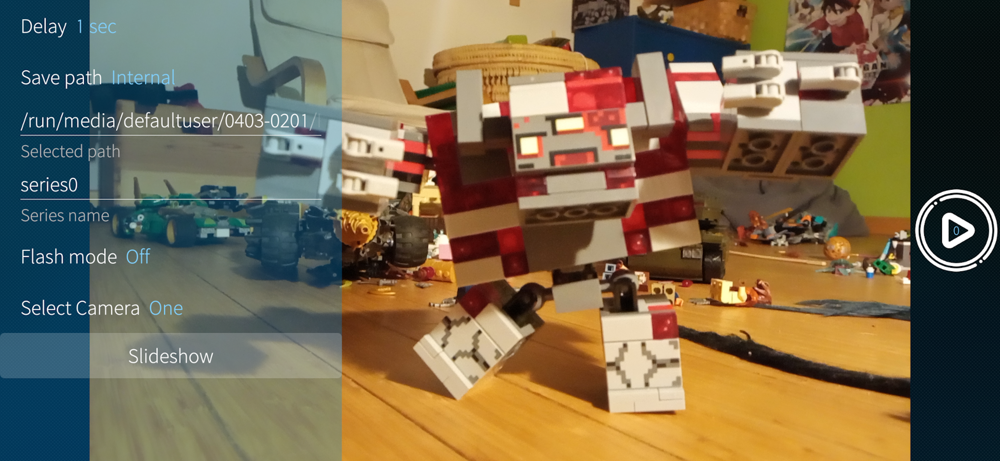

# harbour-stopmotion

A simple qt/qml stopmotion photo app for creating a time series of photos to create animations on SFOS.

Parts of the Recording screen are based on a qml app that was once available for SFOS called, Timelapse. 

A number of elements from the Slideshow views originate with Joni Korhonen Slideshow for SFOF:
https://github.com/pinniini/harbour-slideshow

This is beta quality software, but works suprisingly well. Planned are c++ backends to control other cameras,
more camera control more animation options.

The output encoding to mp4 is currently done via python and ffmpeg.
